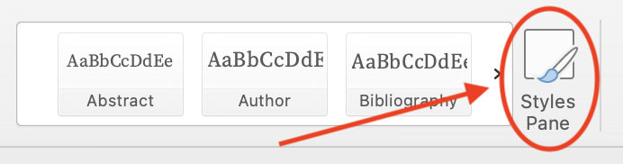
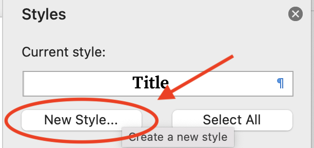
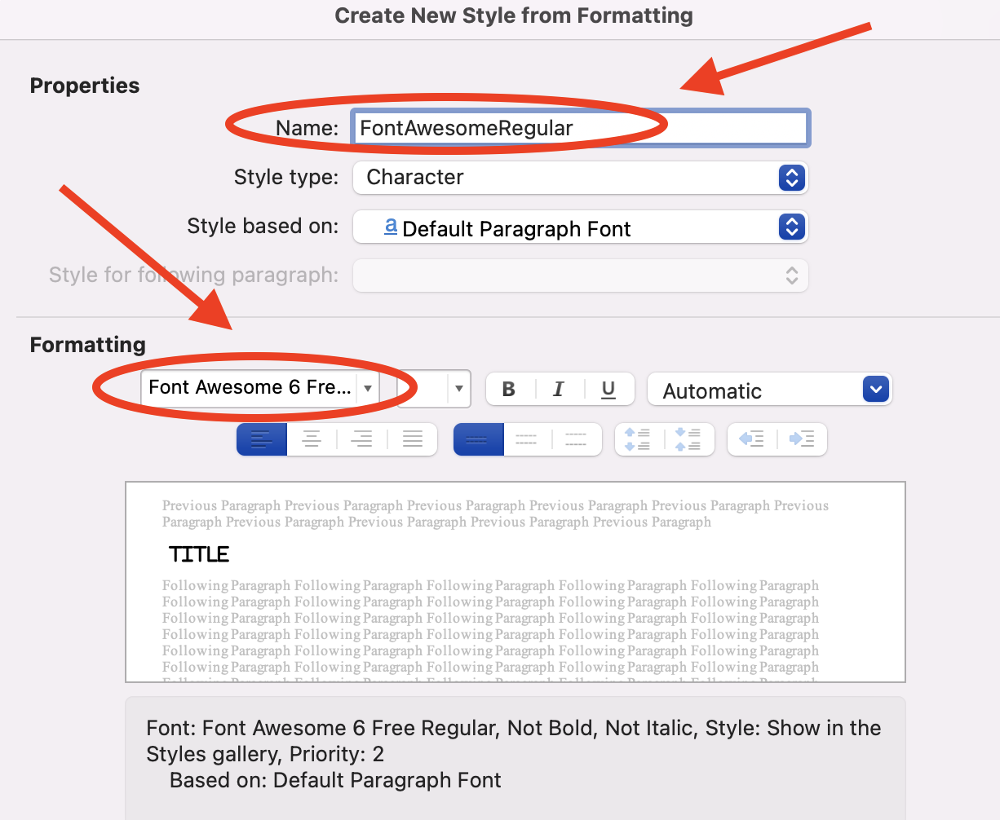
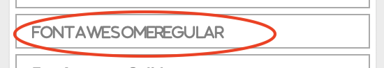

Font Awesome DOCX sets the font of Font Awesome Icons in DOCX
=============================================================

[![GitHub build status][CI badge]][CI workflow]

Font Awesome DOCX is a Lua filter used to set the font of [Font Awesome](https://fontawesome.com/) icons in Microsoft Word documents generated by Pandoc.

If the font for your Microsoft Word document does not support Font Awesome icons, you will end up with blank squares or a random character instead of the icon you intended.

This filter automates the setting of the font instead of having to manually post process the document after Pandoc generation

**N.B: This filter is only relevant for Microsoft Word documents and does not support other document formats.**

Prerequisites
-------------

Before using this filter you would need to complete the following steps:

1. Download the Font Awesome Desktop fonts from [Font Awesome Download](https://fontawesome.com/download) and install them on your computer.

1. Then create a DOCX reference document by using the following command:

    ```bash
    pandoc -o custom-reference.docx --print-default-data-file reference.docx
    ```

1. Next open the `custom-reference.docx` file in Microsoft Word and double click on the Styles Pane as annotated in the screenshot below:

    

The steps below guide you on how to create a New Style for the Font Awesome Regular Icons. You will need to repeat these steps for the Font Awesome Solid and Font Awesome Brands icons.

**N.B. Ensure that the Font Awesome Solid style is named _FontAwesomeSolid_, and the Font Awesome Brands style is named _FontAwesomeBrands_ so that the filter functions correctly.**

1. Click on the _New Style_ button. The steps below guide you on how to create a Style for the

    

1. In the _Create New Style_ dialog set the name of the style to _FontAwesomeRegular_.

    **N.B. If you name the style something else the filter will not function correctly.**

1. Ensure that the _Style type_ field is set to _Character_.

1. Ensure that the _Style based on_ field is set to _Default Paragraph Font_.

1. Then choose the font for the Font Awesome regular icons by choosing the appropriate font and click _OK_.

    For the free version of Font Awesome the font name for the regular icons would be similar to _Font Awesome 6 Free Regular_.

    The annotated figure below shows all the settings described above:

    

    The color of the icon matches the font color of the text in the Word document.

    You may optionally choose a color to change the icon's appearance but this will change the color for all Font Awesome regular icons.

1. Next add the text _FontAwesomeRegular_ to the end of the `custom-reference.docx` reference document.

1. Then, highlight the text you added above and scroll down the Styles Pane until you find the _FontAwesomeRegular_ style. Then click on it to set the text to that style.

    

1. Finally, save the `custom-reference.docx` reference document.

Basic Usage
-----------

The Lua filter sets the font for Font Awesome icons by looking for a custom style that is appended to the Font Awesome icons in your Markdown source document.

For example if you using the regular icon like so <i class="fa-regular fa-envelope"></i> in your Markdown source you should modify it to `[`<i class="fa-regular fa-envelope" style="vertical-align: bottom;"></i>`]{.fa-regular}`.

For solid solid icons like <i class="fa-solid fa-mobile-screen-button"></i> you will need to change it to look like `[`<i class="fa-solid fa-mobile-screen-button" style="vertical-align: bottom;"></i>`]{.fa-solid}`.

For brands icons like the github icon <i class="fa-brands fa-github"></i> you should change it to something like `[`<i class="fa-brands fa-github" style="vertical-align: bottom;"></i>`]{.fa-brands}`.

Once you have made the above changes in your markdown run the following command:

```bash
pandoc -f markdown -t docx \
--reference-doc custom-reference.docx \
--lua-filter handle-font-awesome-docx.lua -o output.docx input.md
```

You should now see the Font Awesome icons showing up in the resulting Word document.

License
------------------------------------------------------------------

This pandoc Lua filter is published under the MIT license, see
file `LICENSE` for details.
